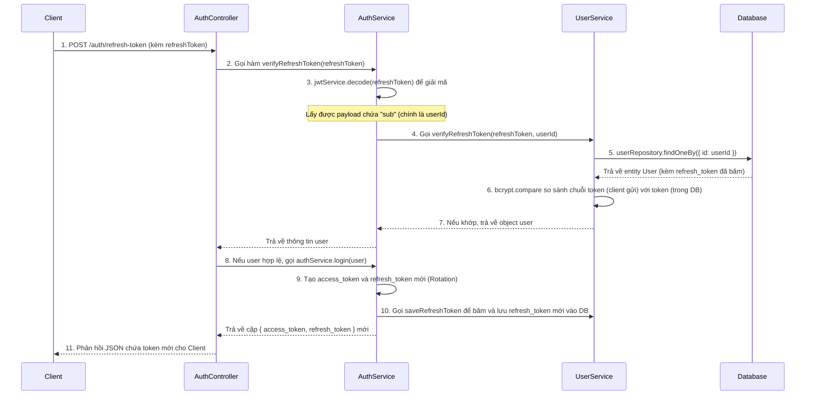

# Luồng hoạt động của Refresh Token trong Project

Luồng hoạt động của tính năng Refresh Token được triển khai trong source code của bạn tuân theo các bước sau. Tính năng này giúp người dùng không phải đăng nhập lại liên tục khi Access Token hết hạn, mà hệ thống sẽ tự động dùng Refresh Token để xin cấp lại Access Token mới.

## Sơ đồ luồng (Sequence Diagram)

## Giải thích chi tiết từng bước theo Source Code

### 1. Client gọi API để Refresh Token
- **File**: `src/auth/auth.controller.ts`
- **Hàm**: `refreshToken` (`POST /auth/refresh-token`)
- Khi Access Token hết hạn, Client sẽ gửi một request kèm `refreshToken` vào body: `{ "refreshToken": "..." }`.
- Đầu tiên, Controller kiểm tra nếu không có biến `refreshToken` gửi lên thì sẽ báo lỗi `BadRequestException`.
- Nếu có, Controller gọi sang hàm `verifyRefreshToken` của `AuthService` và dùng từ khóa `await` để chờ kết quả.

### 2. Giải mã Refresh Token
- **File**: `src/auth/auth.service.ts`
- **Hàm**: `verfiyRefreshToken`
- Tại đây, hệ thống dùng `this.jwtService.decode(refreshToken)` để giải mã chuỗi token mà chưa cần xác thực chữ ký. Mục đích là để lấy thông tin payload nằm trong token, cụ thể là trường `sub` (chứa `userId`).
- Sau khi có được `userId`, hàm này tiếp tục chuyển tiếp `refreshToken` và `userId` sang `UserService` để kiểm tra tính hợp lệ trong cơ sở dữ liệu.

### 3. Đối chiếu Token với Database
- **File**: `src/user/user.service.ts`
- **Hàm**: `verifyRefreshToken(refreshToken, userId)`
- Hệ thống query vào Database thông qua `userRepository.findOneBy` để lấy thông tin của User dựa trên `userId`.
- Nếu tìm thấy User trong DB, hệ thống lấy trường `user.refresh_token` (đây là mã đã được băm bằng bcrypt lúc người dùng đăng nhập).
- Sử dụng hàm `bcrypt.compare` để đối chiếu xem chuỗi `refreshToken` gốc do Client gửi lên có khớp với mã băm trong Database hay không. 
- Nếu khớp (tức là trạng thái `status` trả về `true`), hệ thống trả về nguyên vẹn đối tượng `user`. Nếu không khớp (hoặc không tìm thấy user), hàm sẽ trả về `false`.

### 4. Cấp phát Token mới (Refresh Token Rotation)
- **File**: `src/auth/auth.controller.ts` và `src/auth/auth.service.ts`
- Khi `UserService` đối chiếu thành công, Controller nhận lại đối tượng `user`. (Nếu `user` là `false`, sẽ báo lỗi `Invalid refresh token`).
- Controller tiếp tục gọi hàm `this.authService.login(user)` để tạo một phiên đăng nhập (session) mới dựa trên thông tin của user vừa xác thực.
- Trong hàm `login`:
  - Payload mới được tạo ra: `{ email: user.email, sub: user.id }`.
  - Hệ thống ký (sign) ra một `refresh_token` mới (hạn 7 ngày) và một `access_token` mới.
  - Đồng thời, gọi hàm `this.userService.saveRefreshToken` để băm `refresh_token` mới này và lưu đè lên token cũ trong Database. Việc cấp lại luôn cả Refresh Token mới mỗi lần refresh token cũ được sử dụng gọi là kỹ thuật **Refresh Token Rotation**, giúp hệ thống bảo mật hơn (nếu token cũ bị lộ thì cũng bị vô hiệu hóa).
- Cuối cùng, Controller nhận bộ đôi `{ access_token, refresh_token }` mới từ hàm `login` và phản hồi lại cho Client. Client sẽ dùng Access Token mới để tiếp tục gọi các API cần quyền (như `/auth/profile`).

## Tóm tắt vòng đời
1. Client gửi **Refresh Token** cũ lên endpoint `/refresh-token`.
2. Server giải mã lấy ID, tìm User trong Database, so sánh bằng `bcrypt.compare`.
3. Nếu hợp lệ, Server sinh ra **Access Token** VÀ **Refresh Token** mới, đồng thời lưu đè Refresh Token mới vào DB.
4. Trả cặp token mới cho Client sử dụng tiếp. Mọi thứ diễn ra ngầm (âm thầm) mà không yêu cầu user phải nhập lại email/password.
